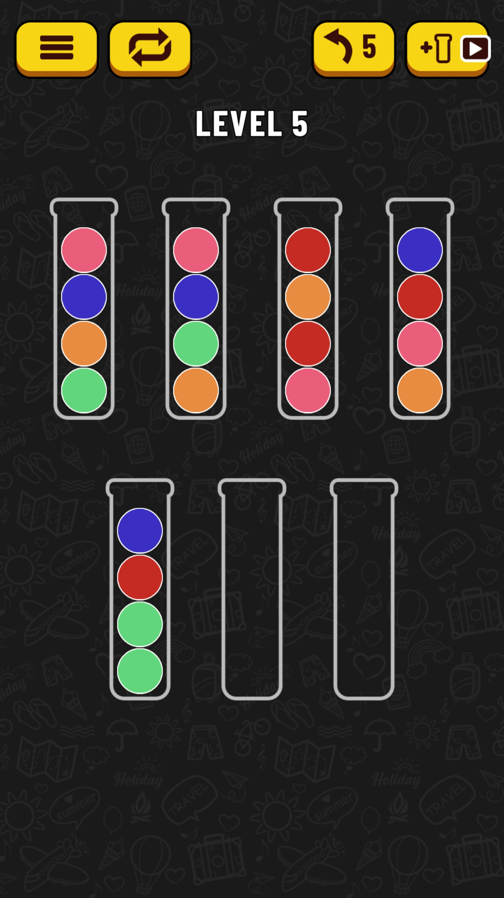

# android-ball-sort-puzzle-solver

> It's Artificial Intelligence!

Solve the Android [Ball Sort Puzzle](https://play.google.com/store/apps/details?id=com.GMA.Ball.Sort.Puzzle) game.

## Local Development

### Setup

I suggest you use [`pyenv`](https://github.com/pyenv/pyenv) and
[`pyenv-virtualenv`](https://github.com/pyenv/pyenv-virtualenv).

Then create a new virtual environment:
```
pyenv virtualenv 3.8.3 absps
```

Then inside the android-ball-sort-puzzle-solver repo,
use the newly created virtual environment:
```
pyenv local absps
```

Upgrade `pip`:
```
pip install -U pip
```

Install the development requirements:
```
pip install -r requirements-dev.txt
```

Configure `pre-commint`:
```
pre-commit install
```

You can run black anytime using:
```
black .
```

## Design

I use a simple plain **string** to represent the state of the game.

The state string consists of:
* `_` to denote an Empty Slot
* `x` to denote a Ball, where x is the color of the Ball
* ` ` (a space) to delimit one tube from another

There is a mapping in `colors.py` from actual color names to a hex digit.
Using this trick I can represent a ball using a single character.

Therefore, the following state:



Will translate to the following state string:
```
8076 8067 a7a8 0a87 0a66 ____ ____
```

From each state string, a helper method can produce all possible next state
strings. This is essentially my **transition function**. The helper function
will also return the move(s) that lead to each next state.

Having an initial state, and a transition function, I can run BFS to search
for states that are solutions.

I can keep generating states, and adding them to the *frontier*, like so:
```
frontier.add(intitial_state);
while frontier.has_states() {
	state = frontier.get_state();

	if is_solution(state) {
		return;
	}

	frontier.add(get_next_states(state));
}
```

When a state is a solution state, the search is over and I return the list of
moves associated with this state.

Some states will come up more than once.
To save time, I try to prevent states from being re-examined.
To do so, I store each visited state, in a **Trie data structure**.
The trie offers fast insertion and lookup.

If a state is "locked", meaning that it cannot produce next states, then OK. I
simply discard this state and I do not increase the size of the *frontier*.

The final piece is the algorithm itself.

I started with a simple **Breadth First Search** to find the solution
with the minimum number of moves.

However, the search space is large enough, so I needed a way to "help" the
algorithm a bit.

I used a custom data structure called `QuantizedDoubleEndedPriorityQueue`.

In simple words, it is a set of double-ended queues. Each queue is associated
with a rank. The rank is the number of "solved" tubes.

So as an example, the following state string has `rank=3`:
```
8888 _067 _a7a _0a7 0a66 ____ ____
```

> Should I count empty tubes as solved? Good question ...

When the algorithm picks the next state to examine,
the `QuantizedDoubleEndedPriorityQueue` will always return the state string
with the maximum rank.

Using this technique, the search is more "pointed" towards states that are
closer to solution, rather than searching through the entire search space.

## Performance

So far, it seems like it can solve levels in under 1sec.

Which is great, because my first iteration on this problem needed more than
60seconds for some levels.

## Things to improve in the future

* Write tests with pytest and achieve 100% coverage

* The following state strings are effectively the same, right?
```
8888 _067 _a7a _0a7 0a66 ____ ____
```
```
____ _067 _a7a _0a7 0a66 ____ 8888
```
So, I should treat them as the same, and "prune" the search space.
And to do so, I should drop the "move from X to Y" notation, since the ordering
of the tubes will make no sense if I shuffle them.
